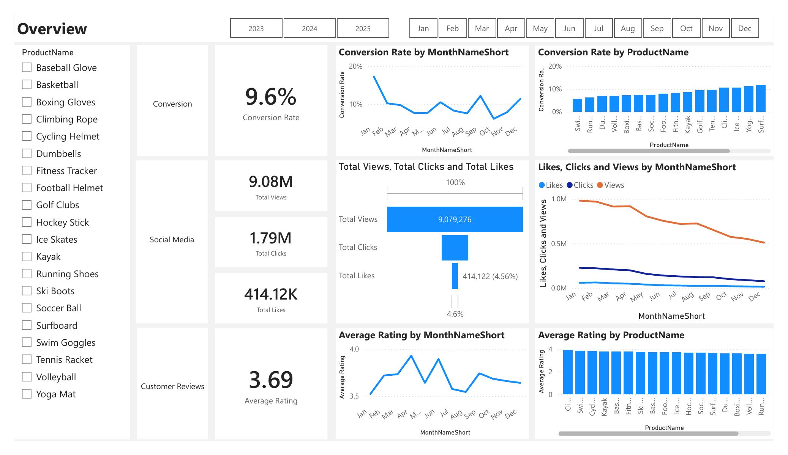
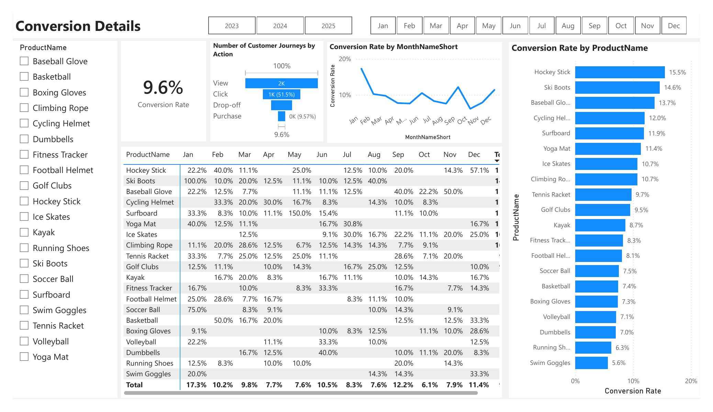
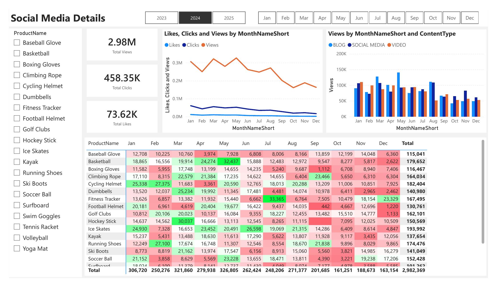
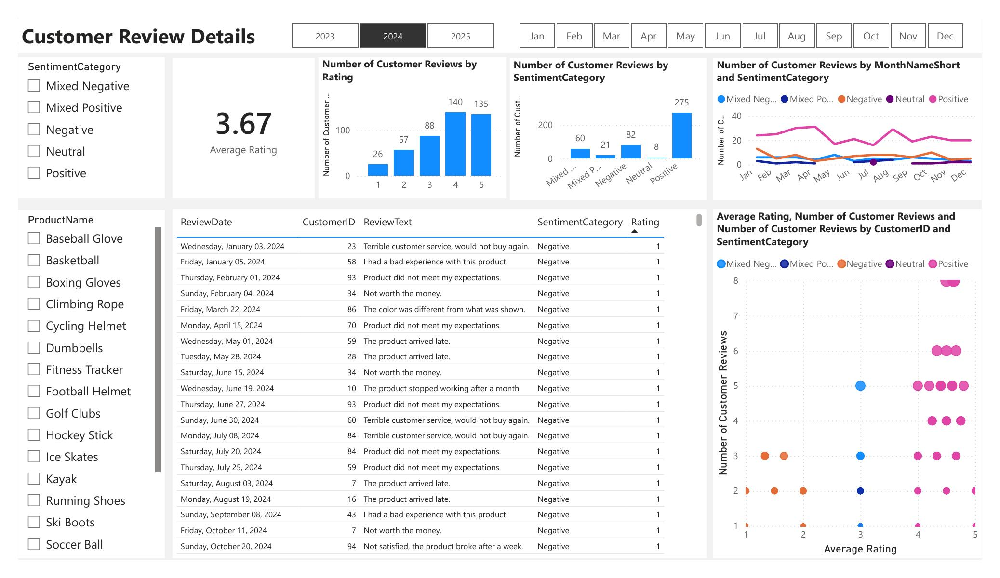

# Marketing Analytics Dashboard — ShopEasy

*SQL and Python pipeline adapted from Ali Ahmad's Data Analyst Portfolio 
Project series; Power BI dashboard build and all analysis/recommendations 
below are my own work.*

## Overview
ShopEasy, an online retail business, was facing reduced customer engagement 
and conversion rates despite increased investment in marketing campaigns. 
This project analyzes customer journey, social media engagement, and 
customer review data to identify the root causes and recommend data-backed 
actions across three business goals: increasing conversion rate, enhancing 
customer engagement, and improving customer feedback scores.

## Tools & Technologies
- **SQL Server** — data cleaning, transformation, and analysis
- **Python** — sentiment analysis of customer reviews (NLTK's VADER)
- **Power BI** — interactive dashboard and reporting

## My Contributions
The initial SQL cleaning scripts and Python sentiment pipeline were adapted 
from a guided tutorial. My own work includes:
- All checkout drop-off, content engagement, and review theme analysis 
  queries built to test specific hypotheses (see Key Insights below)
- The Power BI dashboard build and layout
- The full goals-to-actions business recommendations, derived directly from 
  querying the underlying data rather than the dashboard visuals alone

## Project Structure
```
├── README.md
├── dim_customers.sql
├── dim_products.sql
├── fact_customer_journey.sql
├── fact_customer_reviews.sql
├── fact_engagement_data.sql
├── customer_reviews_enrichment.py
├── fact_customer_reviews_with_sentiment.csv
├── PortfolioProject_MarketAnalytics.pbix
├── PortfolioProject_MarketAnalytics_PowerBI.pdf   (full dashboard export, for a no-install preview)
└── screenshots/
    ├── overview.jpg
    ├── conversion-details.jpg
    ├── social-media-details.jpg
    └── customer-review-details.jpg
```

## Setup
1. Install SQL Server (Express/Developer edition) + SQL Server Management 
   Studio (SSMS)
2. Restore the database from the provided `.bak` backup file:
   - In SSMS, right-click **Databases** → **Restore Database**
   - Source: Device → select the `.bak` file
   - Click OK to restore
3. Run `dim_customers.sql`, `dim_products.sql`, `fact_customer_journey.sql`, 
   `fact_customer_reviews.sql`, and `fact_engagement_data.sql` against the 
   restored database to build/clean the working tables
4. Install Python 3 + `pandas` and `nltk` (with the VADER lexicon downloaded), 
   then run `customer_reviews_enrichment.py` to produce 
   `fact_customer_reviews_with_sentiment.csv`
5. Install Power BI Desktop, open `PortfolioProject_MarketAnalytics.pbix`, 
   and point its data source connections at your local SQL Server instance 
   (`YOUR-PC-NAME\SQLEXPRESS`) and the sentiment CSV

## SQL Cleaning & Transformation
Before analysis, the raw data required cleaning:
- **Standardized ContentType values** using `UPPER`/`REPLACE` — raw data had 
  inconsistent casing/naming (e.g. "Socialmedia" vs "Social Media"), which 
  would have fragmented categories in Power BI visuals if left as-is.
- **Split combined Views/Clicks fields** using `LEFT`/`RIGHT`/`CHARINDEX`, 
  then cast to `INT` — the two metrics were stored together as a single 
  delimited string and returned as text, which blocked aggregation until cast.
- **Deduplicated records** using `ROW_NUMBER()` partitioned by customer, 
  product, date, stage, and action — keeping only the first occurrence of 
  each duplicate group.
- **Filled missing Duration values** using `COALESCE` with the average 
  duration for that date, rather than dropping incomplete rows.
- **Normalized review text** by collapsing inconsistent multiple spaces 
  (a single-pass `REPLACE` missed odd-numbered space runs; fixed with a 
  three-step replace/collapse pattern) so identical canned review phrases 
  grouped correctly instead of counting as separate near-duplicates.
- **Filtered out Newsletter content** from social media analysis, since it 
  followed a different engagement pattern than blog/social/video content.

## Dashboard Preview

**Overview**


**Conversion Details**


**Social Media Details**


**Customer Review Details**


## Key Insights
- **Checkout is the primary leak point**, not top-of-funnel traffic: roughly 
  half of visitors who click never complete a purchase. Drop-off rate is 
  consistently high (59%–88%) across every product rather than concentrated 
  in one category or price tier — indicating a site-wide checkout issue, not 
  a product-specific one. (Per-product purchase counts are small — 5 to 15 — 
  so product-level differences should be treated as directional, not proof.)
- **Video content has the highest engagement rate** (24.55% overall — best 
  on click-through rate, like rate, and overall engagement) despite having 
  the fewest total views of the three content types tracked. Blog has the 
  most views but the lowest engagement quality of the three.
- **Customer feedback splits into two different problems**: high-frequency, 
  moderate-severity complaints (unclear instructions — 73 mentions, avg 
  rating 2.88; value perception — 113 mentions, avg rating 2.5) versus rare, 
  severe complaints (durability, customer service — ~9 mentions each, avg 
  rating 1.0). These call for different priorities: the first affects the 
  most customers per fix; the second is low-volume but likely drives churn.

## Goals & Recommended Actions

### Goal 1: Increase Conversion Rate
- Audit the checkout flow for friction: page load speed, payment options, 
  shipping-cost transparency, trust signals
- Investigate whether time spent at the checkout stage is unusually long, 
  which would point to a UX/technical issue rather than a pricing one
- Re-test using click→purchase conversion specifically after any fix, not 
  overall conversion rate

### Goal 2: Enhance Customer Engagement
- Shift some budget/production effort toward Video, currently under-produced 
  relative to how well it performs
- Re-evaluate Blog strategy — highest reach but lowest engagement quality
- Track engagement rate, not raw views, as the primary content KPI

### Goal 3: Improve Customer Feedback Scores
- Improve product instructions/documentation clarity — affects the most 
  customers of any single fixable issue, and is a low-cost fix
- Address value perception — the single most frequent complaint theme
- Flag the small number of severe complaints (durability, customer service) 
  for urgent review — low volume but near-total dissatisfaction each time
- Improve delivery speed/communication around shipping estimates

## How to Run This Project
1. Clone this repository
2. Restore the SQL Server database from the provided `.bak` file (see Setup)
3. Run the five SQL scripts against the restored database
4. Run `customer_reviews_enrichment.py` to regenerate the sentiment CSV
5. Open `PortfolioProject_MarketAnalytics.pbix` in Power BI Desktop and 
   refresh the data source connections

Don't have SQL Server or Power BI installed? `PortfolioProject_MarketAnalytics_PowerBI.pdf` 
is a full static export of the dashboard — open it in any PDF viewer.

## Future Improvements
- Bucket all review phrases into theme categories with a single `CASE` 
  query, rather than reviewing frequency counts manually
- Test whether checkout duration correlates with drop-off, to isolate a 
  performance/UX cause from a pricing one
- Break down engagement rate by month to check whether the Video advantage 
  holds consistently or is driven by a few standout months
